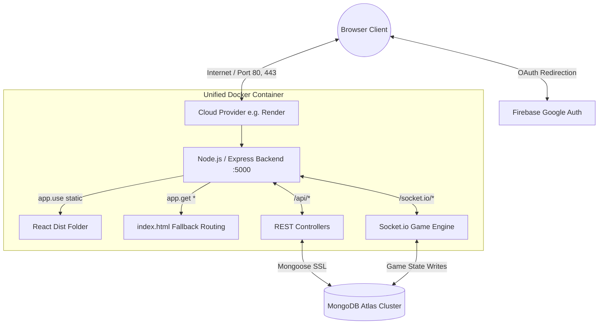
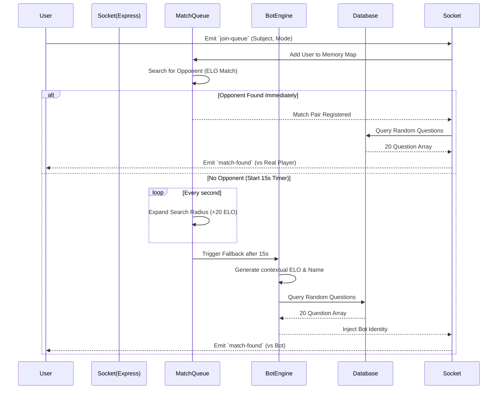
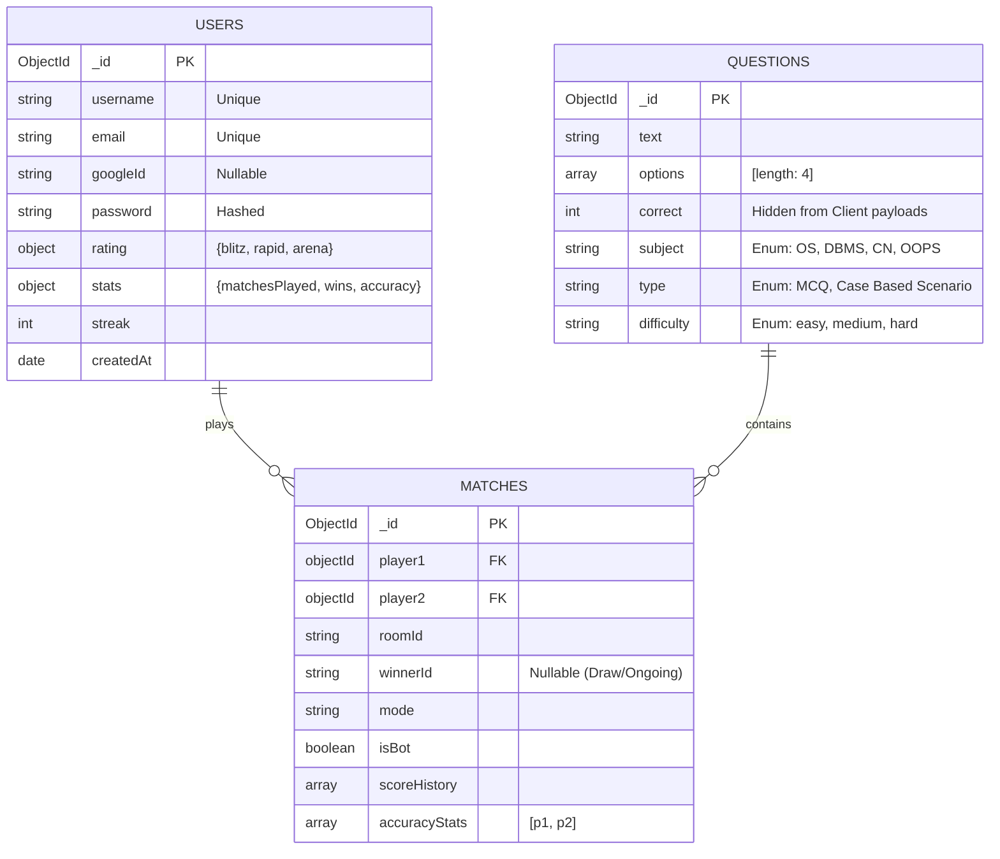

# CSClash Arena ⚔️

A fully-featured, high-performance, real-time multiplayer coding and computer science quiz platform. Battle against friends globally, queue into intelligent algorithmic bots, and climb the global ELO leaderboards. Designed natively for speed, security, and infinite cloud scalability.

---

## 🏗️ 1. High-Level System Architecture

The CSClash Arena architecture is built on a highly-optimized dual-stage unified **Docker** infrastructure. It leverages a single monolithic deployment unit to simultaneously host static Single-Page Application (SPA) clusters and dynamic WebSockets. 

### 1.1 Docker Build Lifecycle (Deep Dive)
To achieve zero CORS overhead and sub-millisecond local network speeds between the frontend and backend, the project uses a highly specialized **Multi-Stage Build**:
1. **Stage 1 (Frontend Builder):** Downloads `node:18-alpine`. Installs all frontend dependencies. Render injects the public `VITE_FIREBASE_` variables natively through `ARG` declarations directly into the Vite compiler. Calculates Tree-Shaking, Minification, and outputs an ultra-lightweight `/dist` directory.
2. **Stage 2 (Unified Monolith):** Downloads a fresh `node:18-alpine` image to strip away all unnecessary frontend build tools (saving hundreds of MBs of RAM). Sets `NODE_ENV=production`. Copies the Express backend. Finally, it copies ONLY the `/dist` folder from Stage 1 into the staging ground. 
3. **Execution:** Node initiates `server/index.js`, seamlessly fusing the compiled frontend payload identically onto the exact same `origin` as the REST APIs and WebSockets.

---

## ⚡ 2. Core Operational Flowcharts

### 2.1 The Matchmaking Sequence Diagram
CSClash uses a dynamic ELO-expansion algorithm. It attempts to find a PvP match by incrementally widening the acceptable ELO criteria by 20 points per second. If no human is found within 15 seconds, an algorithmic Bot is instantiated dynamically.

### 2.2 Security & Authentication Flow
We strictly decouple Authentication from Database Authorization.
1. The Client contacts **Google Firebase** to perform OAuth verification.
2. Firebase returns a high-entropy string `idToken`.
3. The Client POSTs the `idToken` to the `/api/auth/google` route.
4. The Backend cryptographically validates the token. Only then is a user created/restored in MongoDB.
5. A completely custom, isolated JWT session token is returned via HttpOnly cookies and LocalStorage for WebSockets.

---

## 🗃️ 3. Entity Relationship Diagram (ERD)

Data is structured in highly normalized NoSQL schemas.

---

## 🚀 4. Production Deployment Guide (Render.com)

The entire application is completely ready for a **1-Click Free Deployment** using Render's Docker environments.

### Step 1: Push to GitHub
Upload your repository using `git add .`, `git commit -m "Production V1"`, and `git push origin main`.

### Step 2: Render Configuration
Log into [Render.com](https://render.com) and create a **Web Service**. Connect your GitHub repository.
Ensure the deployment type is set to **Docker**.

### Step 3: Map the Environment Variables
*Crucial: Render protects your Docker Compiler from your dashboard variables by default. Our custom Dockerfile bridges this gap utilizing strictly typed `ARG`s.*

In your Render dashboard, inject the following secrets:
- `PORT` = `5000`
- `NODE_ENV` = `production`
- `MONGO_URI` = `mongodb+srv://...`
- `JWT_SECRET` = `very_complex_secret`
- `VITE_FIREBASE_API_KEY` = `...`
- `VITE_FIREBASE_AUTH_DOMAIN` = `...`
- `VITE_FIREBASE_PROJECT_ID` = `...`
- `VITE_FIREBASE_STORAGE_BUCKET` = `...`
- `VITE_FIREBASE_MESSAGING_SENDER_ID` = `...`
- `VITE_FIREBASE_APP_ID` = `...`

Hit **Deploy**. Watch the terminal beautifully execute the unified Node compilation sequence safely over the cloud.

---

 
 

> *“Art should comfort the disturbed and disturb the comfortable.”*  
> ― Banksy
