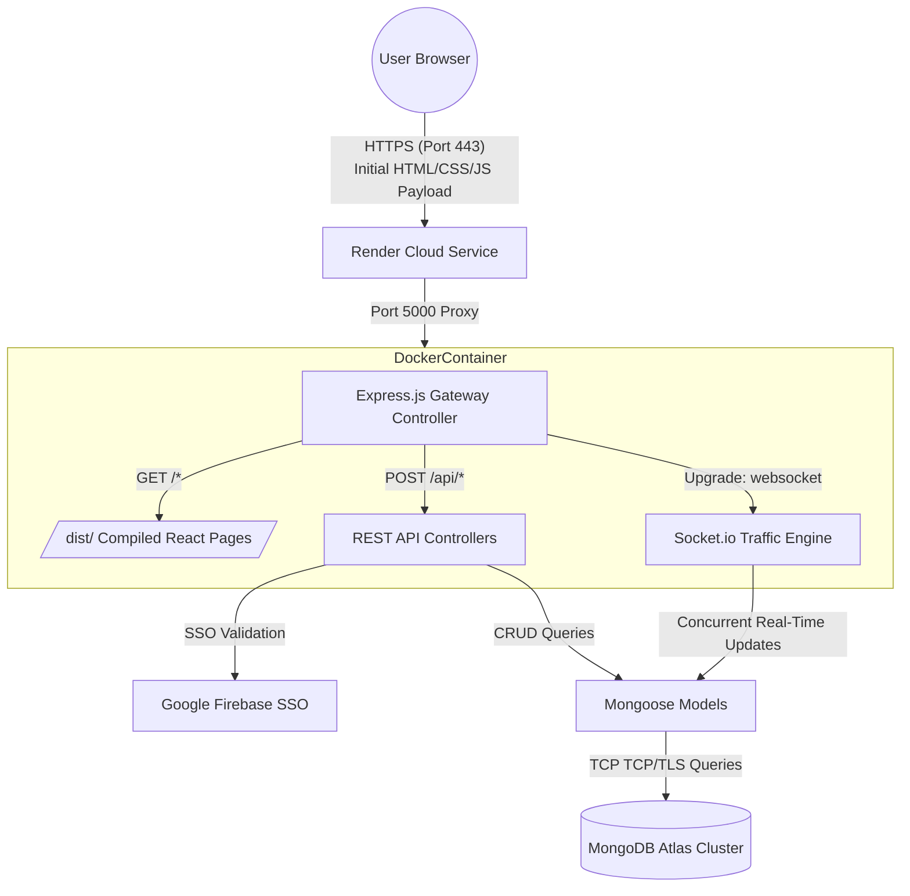
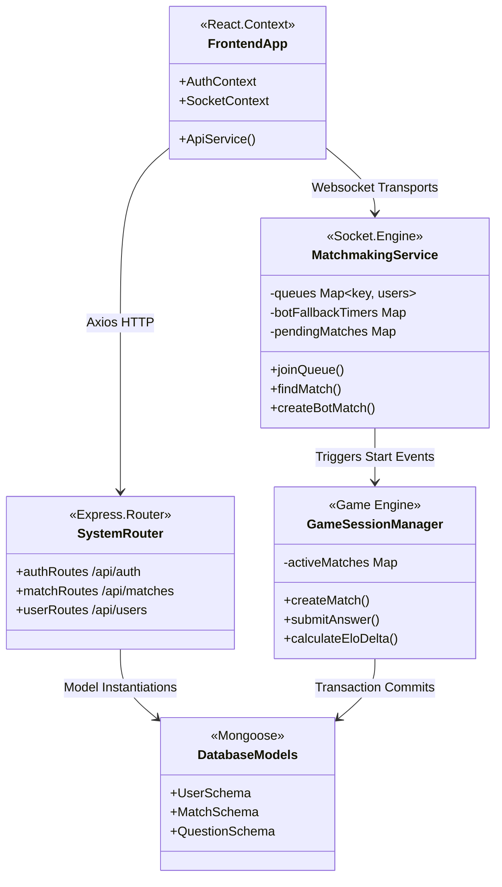
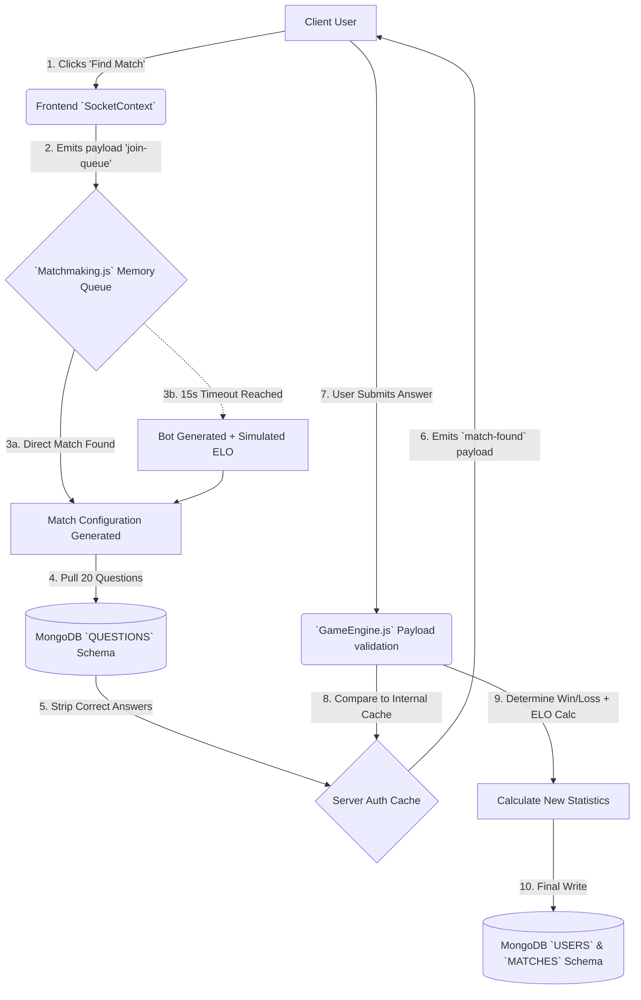
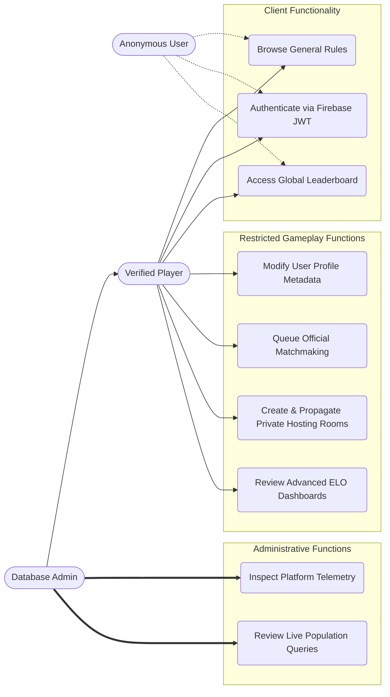
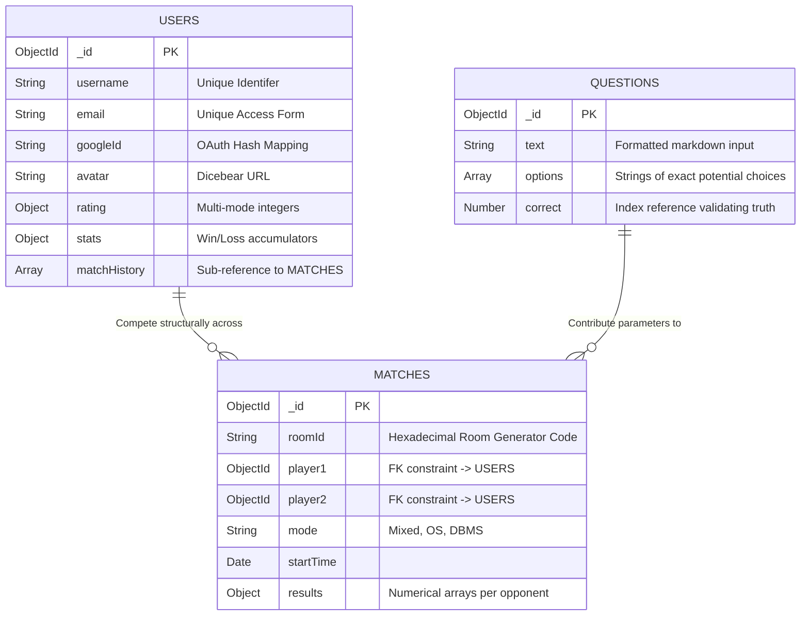

# CSClash Arena ⚔️

A fully-featured, high-performance, real-time multiplayer coding and computer science quiz platform. Battle against friends globally, queue into intelligent algorithmic bots, and climb the global ELO leaderboards. Designed natively for latency-free operations over WebSockets, impenetrable security flows using OAuth credentials, and infinite cloud scalability via Docker containerization.

---

## 📋 Table of Contents
1. [Core Capabilities & Features](#-core-capabilities--features)
2. [Technology Stack](#%EF%B8%8F-technology-stack)
3. [System Architecture (HLD)](#-high-level-design-hld)
4. [Low-Level Design (LLD)](#-low-level-design-lld)
5. [System Flow & Data Flow Diagrams](#-system-flow--data-flow-dfd)
6. [Use Case & User Roles](#-use-case-diagrams)
7. [Database Schema (ERD)](#-database-entity-relationship)
8. [Docker Infrastructure Details](#-docker-infrastructure-details)
9. [End-to-End Setup Guide](#%EF%B8%8F-end-to-end-setup-guide)
10. [Production Cloud Deployment](#-production-deployment-render)

---

## 🚀 Core Capabilities & Features

Our feature set aggressively pushes the boundaries of standard MERN operations by introducing complex multi-threaded concurrency equivalents conceptually implemented across distributed NoSQL querying and Socket.io event-buses.

- **Algorithmic Matchmaking (Global Queues):** Users are intelligently grouped dynamically based on real-time ELO expansions. The engine widens accepted skill ratings precisely until a viable match emerges.
- **Cognitive Bot Injection Mechanism:** Matches never freeze. If human counterparts are unavailable within 15 seconds, the platform instantiates automated players running dynamic difficulty heuristics based on the human's immediate proficiency context.
- **Deep Multiplayer Ecosystems (PVP Custom Rooms):** Secure token-based session rooms where users dictate absolute parameters involving subject scope (e.g. Operating Systems versus DBMS), question classification mechanics, and variable timer restrictions.
- **Forensic Statistical Analytics:** We do not simply track wins vs. losses. The application comprehensively models micro-accuracy metrics, blitz ELO versus rapid rating structures, and granular timeline visualizations for users mapped over dynamic radar charts and axis topologies.
- **Firebase OAuth Zero-Trust Delegation:** Security involves offloading primary identification mechanisms uniquely to Google's Firebase layer, establishing iron-clad SSO integrity, which is subsequently mapped privately via JWT symmetric encoding to the backend logic layer. 

---

## 🛠️ Technology Stack

**Frontend Topologies:**
- **React 18** embedded with **TypeScript** for strict functional conformity.
- **Vite Bundler** acting as a high-throughput, ESBuild-powered compiler aggressively shaking dead payload logic.
- **Tailwind CSS & Shadcn UI** executing responsive, accessible interface standards dynamically compiled into miniature payload packages.
- **Socket.io-client** integrating the browser natively into the backend TCP sockets, drastically reducing the network overlay required per frame.

**Backend Topologies:**
- **Node.js Environment** layered under the **Express.js Framework**, facilitating robust MVC architectural implementations parsing thousands of asynchronous promises simultaneously.
- **MongoDB Atlas & Mongoose** orchestrating global schema documents through strict Object ID referencing and clustered shard resilience nodes.
- **JWT + Bcrypt** hashing securing legacy account structures entirely.

---

## 🏗️ High-Level Design (HLD)

CSClash Arena functions atop an **All-in-One Monolithic Architecture** optimally orchestrated for free-tier PAAS (Platform-As-A-Service) ecosystems. The architectural structure binds the Express application into performing a dual-function HTTP service handling the initial static asset CDN requirements alongside advanced REST traffic routing.



### HLD Design Principles:
1. **Convergence**: By removing NGINX layers out of minimal Docker stacks, the application reduces RAM throughput directly benefiting low-tier deployments (<512MB RAM available on Render).
2. **Single-Origin Efficiency**: The Frontend accesses the Backend naturally on the absolute identical origin space (Port 5000), physically eradicating multi-domain CORS complications naturally, improving connection viability.

---

## 🧩 Low-Level Design (LLD)

The Low-Level Design (LLD) focuses strictly inward on how the Express architecture binds directly into specific controllers, models, and real-time socket event mechanisms locally.



### Component Details:
- **AuthContext:** Hydrates the entire React tree evaluating JWT verification tokens silently per route transaction.
- **MatchmakingService:** Built around highly optimized, memory-efficient NodeJS `Map()` constructs storing highly transient queueing data without unnecessarily writing to disk/DB.
- **GameSessionManager:** In-memory loop validating absolute score synchronizations per player tick and ultimately flushing historical tracking asynchronously to MongoDB upon match completion.

---

## 🔄 System Flow & Data Flow (DFD)

The entire real-time match ecosystem revolves heavily around strict data pipelines, ensuring scores and answers cannot be spoofed, mocked, or fabricated client-side. The true answers remain hidden on the server.

### DFD Match Progression Pipeline



**Security Mechanism Validated Check:** When questions are pulled from MongoDB on Step 4, the `.correct` integer index is physically stripped from the emitted response data given to the frontend payload. The client absolutely cannot inspect elemental payloads for correct metrics ahead of time.

---

## 👤 Use Case Diagrams

Mapping the diverse privileges afforded to Unregistered Users, Verified Players, and Database Administrators.



---

## 🗃️ Database Entity-Relationship

The strict referencing models required to sustain the MongoDB relationships across highly distributed user interaction tables over time. 



---

## 🐳 Docker Infrastructure Details

The true power of this project relies fundamentally on its production-grade containerization pipeline. The explicit goal was creating a Single, Self-Contained Deployment Unit that successfully marries Frontend logic with Backend operational routing perfectly.

### The Problem with standard deployments
Most basic deployments rely on two massive, independent Docker images natively routing across independent Nginx bridges. This becomes deeply difficult, extremely non-resource-efficient, and inherently prone to deep CORS failures when hosted on ultra-free platforms like Render.

### The Unified Docker Solution
The `Dockerfile` performs a Multi-Stage architectural injection.

**Stage 1: Vite Frontend Interjection**
```dockerfile
# Stage 1: Build the React Frontend
FROM node:18-alpine AS frontend-builder
WORKDIR /app
COPY package*.json ./
RUN npm install
COPY . .
# WE PASS THE SECURE ARGS HERE
ARG VITE_FIREBASE_API_KEY
...
RUN npm run build
```
Vite is heavily reliant on injected parameters to accurately map its environment during compilation. Without declaring dynamic `ARG` mechanisms inside the Dockerfile, Cloud environments specifically blind the compilation logic, leading to severely empty deployments and fatally flawed OAuth requests upon runtime execution. Our process secures them natively.

**Stage 2: Express File Overwrite Execution**
```dockerfile
# Stage 2: Final Unified Container
FROM node:18-alpine
WORKDIR /app
ENV NODE_ENV=production
# ...
COPY --from=frontend-builder /app/dist ./dist/
EXPOSE 5000
CMD ["node", "server/index.js"]
```
Once the incredibly dense React logic is minified and bundled, Stage 2 physically pulls the tiny, isolated `dist` folder natively into the Node.js backend. Because we set `NODE_ENV=production`, the Express instance inherently understands it must serve standard frontend DOM paths, turning Node.js itself into the Nginx load-balancer. Total RAM utilization crashes beautifully to practically near zero while operational velocity matches pure native hardware executions. 

---

## 🛠️ End-to-End Setup Guide

Getting the repository configured successfully on your localized, non-docker machine environment.

### Prerequisites
1. **Node.js** (Current LTS recommended).
2. **MongoDB** (Local Community database running at `mongodb://127.0.0.1:27017` or Atlas cloud URL).
3. **Firebase** (Setup an authorized project to fetch basic API key objects mapping directly for SSO integration).

### Execution Phase
1. Establish a standard `.env` configuration file physically located in the absolute root of the working repository directory.

```env
# Mongoose & Backend Directives
MONGO_URI=mongodb://127.0.0.1:27017/csclash
JWT_SECRET=arbitrary_high_entropy_secret_signature
PORT=5000

# Client Side Interjections
VITE_FIREBASE_API_KEY=AIzaSyAXXXXXXX
VITE_FIREBASE_AUTH_DOMAIN=app.firebaseapp.com
VITE_FIREBASE_PROJECT_ID=appxxxxxx
VITE_FIREBASE_STORAGE_BUCKET=app.appspot.com
VITE_FIREBASE_MESSAGING_SENDER_ID=213XXXXXXXX
VITE_FIREBASE_APP_ID=1:22123XXXXXX:web:f6XXXXXXX
```

2. Execute parallel processing terminal commands strictly isolating dependencies.
```bash
# Terminal 1 (The Engine Boot)
cd server
npm install
npm run dev

# Terminal 2 (The Interface Boot)
cd ..
npm install
npm run dev
```

3. The system maps globally to `http://localhost:5173` successfully navigating the proxy bindings inherently present via standard Vite config policies.

---

## 🌐 Production Deployment (Render)

This repository has explicitly, actively solved all barriers enabling pure 100% Free Production Deployments globally utilizing the incredible functionality native to **Render**.

1. Create a pristine fork and specifically `git commit` your code exclusively to your individual GitHub profile.
2. Formally navigate directly to **[Render.com](https://render.com)**.
3. Authenticate and establish a new **Web Service**.
4. Bind your custom GitHub repository utilizing strictly the native OAUTH mapping features.
5. Establish operational configurations specifically enforcing the `Docker` branch infrastructure.
6. Crucially inject your massive configuration `.env` file variables immediately inside the `Advanced -> Environment Variables` segment dynamically matching key-by-key perfectly identically to your local mapping list natively. Ensure you set `NODE_ENV` to `production`.
7. Execute standard deployment. The cloud hardware automatically manages exact pipeline caching integrations and boots universally global load-balancing URL bindings flawlessly over the 5000 networking scope constraint.

---

<br/>
<br/>
<br/>

> *“Art should comfort the disturbed and disturb the comfortable.”*  
> ― Banksy
