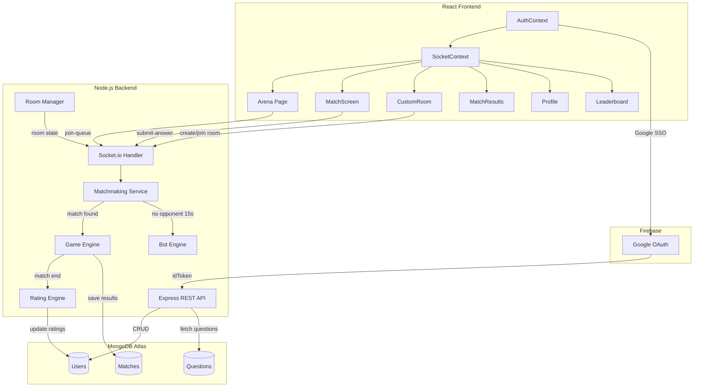
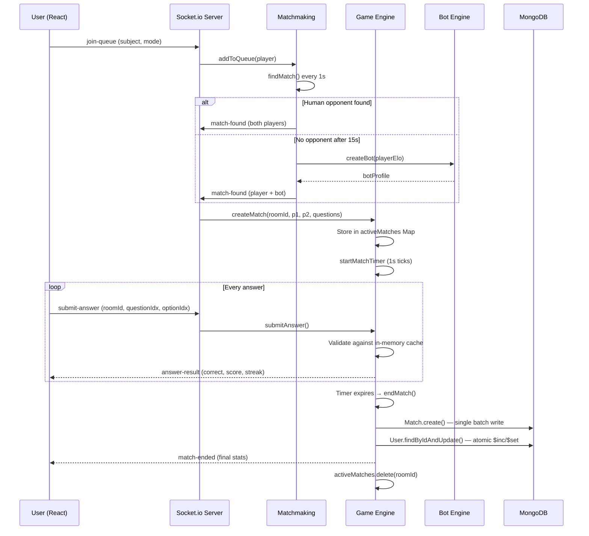
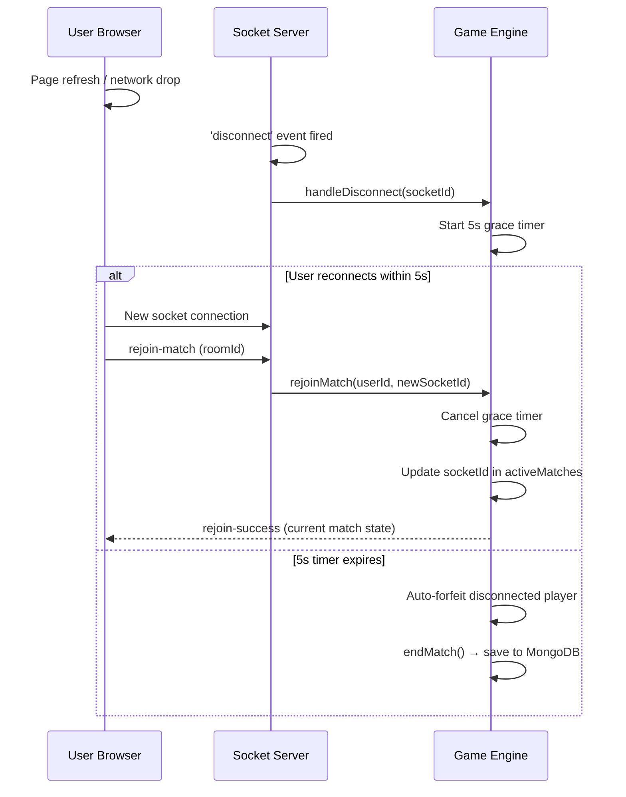
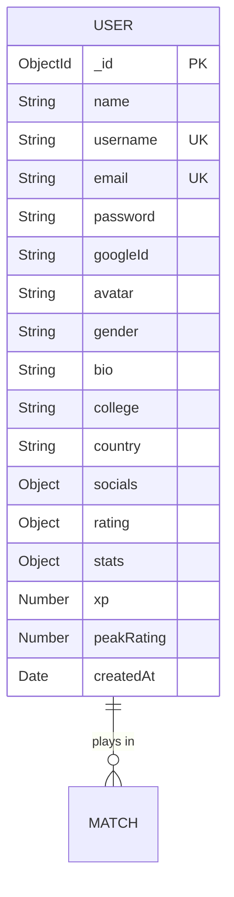
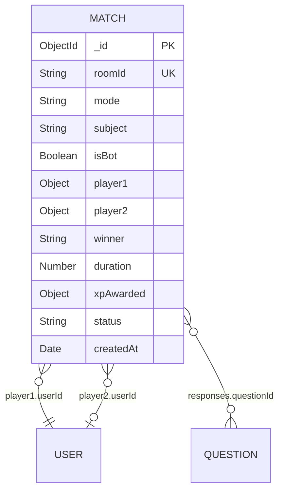
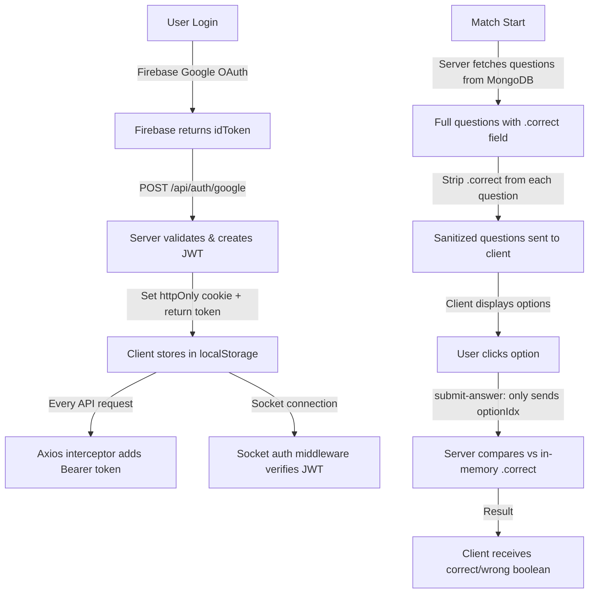

# CSClash Arena ⚔️

**A real-time 1v1 competitive quiz engine for core Computer Science subjects — built for placement prep.**

> Battle your peers in timed 1v1 CS quizzes covering OS, DBMS, CN, and OOPs. A server-authoritative game engine ensures fair play, an Elo-based matchmaking system guarantees balanced opponents, and an intelligent bot engine keeps wait times near zero.

🔗 **Live Demo:** [https://lunchbreak.onrender.com](https://lunchbreak.onrender.com)
📦 **Repository:** [https://github.com/sherlock-hashed/LunchBreak](https://github.com/sherlock-hashed/LunchBreak)

---

## 📋 Table of Contents

- [Problem Statement](#-problem-statement)
- [Solution](#-solution)
- [Tech Stack](#-tech-stack)
- [Features](#-features)
- [System Architecture](#-system-architecture)
- [High-Level Design (HLD)](#-high-level-design-hld)
- [Low-Level Design (LLD)](#-low-level-design-lld)
- [Database Schema](#-database-schema)
- [API Reference](#-api-reference)
- [Socket.io Events](#-socketio-events)
- [Scoring & Rating Engine](#-scoring--rating-engine)
- [Bot Engine](#-bot-engine)
- [Security Architecture](#-security-architecture)
- [Project Structure](#-project-structure)
- [Installation & Setup](#-installation--setup)
- [Deployment](#-deployment)
- [Usage](#-usage)
- [Key Challenges & Learnings](#-key-challenges--learnings)
- [Future Improvements](#-future-improvements)
- [Author](#-author)

---

## 🎯 Problem Statement

Engineering students preparing for placement interviews lack an engaging, competitive platform to practice core Computer Science MCQs. Existing quiz apps are:

- **Solo-only** — No real opponent means no competitive pressure or urgency
- **Unsecured** — Answers can be inspected via browser DevTools
- **Static** — No adaptive difficulty or skill-based matching
- **Boring** — No gamification, rankings, or progression systems

---

## 💡 Solution

**CSClash Arena** solves this by providing a real-time, multiplayer quiz experience:

| Problem | CSClash Solution |
|---------|-----------------|
| No competitive pressure | Live 1v1 matches with real-time score updates |
| Answer leaking via DevTools | Server-authoritative engine — answers never reach the client |
| No skill-based matching | Elo rating system with progressive queue expansion |
| Long wait times | Intelligent bot fallback within 15 seconds |
| No progression system | XP, streaks, rank tiers (Explorer → Elite), leaderboards |

---

## 🛠 Tech Stack

| Layer | Technology |
|-------|-----------|
| **Frontend** | React 18, TypeScript, Vite (SWC), Tailwind CSS, Shadcn UI, Recharts |
| **Backend** | Node.js, Express.js |
| **Real-Time** | Socket.io (WebSocket + polling fallback) |
| **Database** | MongoDB Atlas (Mongoose ODM) |
| **Authentication** | Firebase Google OAuth + JWT (custom-issued) |
| **Containerization** | Docker (multi-stage build) |
| **Deployment** | Render (unified container) |
| **UI Components** | Radix UI primitives, Lucide React icons, Framer Motion |

---

## ✨ Features

### 🎮 Game Modes
- **Blitz (60s)** — Fast-paced 10-question matches
- **Rapid (90s)** — Extended matches for deeper questions
- **Training** — Solo practice without rating impact
- **Arena (Custom Rooms)** — Private 1v1 with configurable settings (subject, duration, question type, rating impact)

### 🧠 Core CS Subjects
- **Operating Systems (OS)** — Process scheduling, memory management, deadlocks
- **Database Management (DBMS)** — SQL, normalization, transactions, indexing
- **Computer Networks (CN)** — OSI model, TCP/IP, routing, protocols
- **Object-Oriented Programming (OOPs)** — Polymorphism, inheritance, design patterns

### 📊 Analytics & Progression
- **Elo Rating System** — Separate ratings for Blitz, Rapid, and Arena modes
- **XP & Rank Tiers** — Explorer → Scholar → Specialist → Master → Elite
- **Skill Radar Chart** — Subject-wise accuracy and speed visualization
- **Match History** — Detailed per-question breakdown with response times
- **Score Progression Charts** — Cumulative score graphs per match
- **Topic-wise Performance** — Accuracy breakdown by CS topic
- **Leaderboard** — Global rankings filterable by mode (Blitz/Rapid/Overall XP)

### 🤖 Intelligent Bot System
- **Adaptive Difficulty** — Bot accuracy and response speed scale with user Elo
- **Realistic Behavior** — Randomized response delays with configurable variation
- **Themed Names** — Kernel_King, Cache_Master, Socket_Sage, Thread_Titan, etc.

### 🛡️ Security
- **Server-Authoritative Scoring** — Answers validated server-side only
- **Payload Sanitization** — Correct answer indices stripped before client broadcast
- **JWT Authentication** — Stateless session management with httpOnly cookies
- **Google OAuth** — Secure SSO via Firebase with automatic account creation

### 🔌 Real-Time Features
- **Live Score Updates** — Instant feedback on opponent's progress
- **Reconnection Handling** — 5-second grace period for network drops
- **Online Player Count** — Live count of connected users
- **Custom Room Sharing** — 6-character room codes with link sharing

---

## 🏗 System Architecture

### Architecture Overview

```
┌─────────────────────────────────────────────────────────────────────┐
│                        DOCKER CONTAINER                             │
│  ┌───────────────────────────────────────────────────────────────┐  │
│  │                   Node.js / Express Server                    │  │
│  │                       (Port 5000)                             │  │
│  │  ┌─────────────────┐  ┌────────────────────────────────────┐ │  │
│  │  │   REST API       │  │        Socket.io Server            │ │  │
│  │  │   /api/auth      │  │                                    │ │  │
│  │  │   /api/users     │  │  ┌──────────┐  ┌───────────────┐  │ │  │
│  │  │   /api/matches   │  │  │Matchmaker│  │  Game Engine   │  │ │  │
│  │  │   /api/questions  │  │  │  Queue   │  │ (In-Memory Map)│  │ │  │
│  │  │   /api/admin     │  │  └────┬─────┘  └───────┬───────┘  │ │  │
│  │  └─────────────────┘  │       │                 │          │ │  │
│  │                       │  ┌────┴─────┐  ┌───────┴───────┐  │ │  │
│  │  ┌─────────────────┐  │  │  Rating  │  │  Bot Engine   │  │ │  │
│  │  │  Static Files   │  │  │  Engine  │  │ (ELO-scaled)  │  │ │  │
│  │  │  (React dist/)  │  │  └──────────┘  └───────────────┘  │ │  │
│  │  └─────────────────┘  └────────────────────────────────────┘ │  │
│  └───────────────────────────────────────────────────────────────┘  │
│                              │                                      │
│                              ▼                                      │
│                   ┌──────────────────┐                              │
│                   │  MongoDB Atlas   │                              │
│                   │  (Users, Matches │                              │
│                   │   Questions)     │                              │
│                   └──────────────────┘                              │
└─────────────────────────────────────────────────────────────────────┘
```

### Why Monolithic?

The application is deployed as a **single unified container** where Express serves both the API and the compiled React `dist/` folder. This eliminates:
- CORS configuration complexity
- Multi-service orchestration overhead
- Optimal for free-tier PAAS constraints (512MB RAM on Render)

---

## 📐 High-Level Design (HLD)



### Request Flow



---

## 🔬 Low-Level Design (LLD)

### In-Memory State Management

The game engine avoids database writes during active gameplay. All match state lives in RAM:

```javascript
// server/services/gameEngine.js
const activeMatches = new Map();  // roomId → MatchState

// MatchState structure:
{
  roomId: "uuid-v4",
  player1: { id, username, socketId, score: 0, answers: [], streak: 0 },
  player2: { id, username, socketId, score: 0, answers: [], streak: 0 },
  questions: [...],           // Full questions WITH correct answers
  currentQuestion: 0,
  timeLeft: 60,               // Decremented every 1s via setInterval
  status: "active",
  botTimeouts: [],             // Scheduled bot responses (clearable)
}
```

**Why Maps over MongoDB?**
- Reading/writing to RAM = ~0ms latency
- MongoDB write = ~50-200ms network round trip
- A 60-second match with 2 players generates ~20+ score mutations
- Using Maps reduces database writes from ~20+ per match to exactly **1** (at match end)

### Matchmaking Queue Architecture

```javascript
// server/services/matchmaking.js
const queues = new Map();          // queueKey → [QueueEntry]
const pendingMatches = new Map();  // pendingId → PendingMatch
const botTimers = new Map();       // odlomerId → TimeoutId

// Queue expansion logic:
// Second 0-5:   ±50 Elo range
// Second 5-10:  ±150 Elo range
// Second 10-15: ±350 Elo range
// Second 15+:   Bot injection (guaranteed match)
```

### Answer Validation Pipeline

```mermaid
flowchart LR
    A[Client clicks Option B] -->|"emit: submit-answer<br/>{questionIdx: 3, optionIdx: 1}"| B[Socket Handler]
    B --> C[Game Engine]
    C --> D{Compare optionIdx<br/>vs questions[3].correct<br/>in activeMatches Map}
    D -->|Match| E["score += 4<br/>streak++<br/>emit: answer-result ✅"]
    D -->|No Match| F["score -= 1<br/>streak = 0<br/>emit: answer-result ❌"]
```

> **Note:** The client never receives `questions[i].correct`. It is stripped out in `socketHandler.js` before the `match-found` event is emitted.

### Disconnect Recovery Sequence



---

## 🗄 Database Schema

### User Schema



```javascript
rating: {
  blitz:  { type: Number, default: 1200 },
  rapid:  { type: Number, default: 1200 },
  arena:  { type: Number, default: 1200 },
}

stats: {
  matchesPlayed: Number,
  wins: Number,
  losses: Number,
  draws: Number,
  bestStreak: Number,
}
```

### Match Schema



```javascript
// Each player sub-document:
player1: {
  userId: ObjectId (ref: User),
  username: String,
  score: Number,
  correct: Number,
  wrong: Number,
  skipped: Number,
  accuracy: Number,
  avgResponseTime: Number,
  fastestResponse: Number,
  slowestResponse: Number,
  streak: Number,
  ratingBefore: Number,
  ratingAfter: Number,
  responses: [{
    questionId: ObjectId (ref: Question),
    selectedOption: Number,
    correct: Boolean,
    responseTime: Number,
  }]
}
```

### Question Schema

```javascript
{
  text: String,                        // "What is a deadlock?"
  options: [String],                   // Exactly 4 options
  correct: Number,                     // Index 0-3 (NEVER sent to client)
  subject: ["OS", "DBMS", "CN", "OOPs"],
  topic: String,                       // "Process Synchronization"
  difficulty: ["Easy", "Medium", "Hard"],
  type: ["MCQ", "MSQ", "Case Based Scenario"],
  explanation: String,                 // Shown post-match for wrong answers
  tags: [String],
}
// Compound index: { subject, topic, difficulty, type }
```

---

## 📡 API Reference

### Authentication

| Method | Endpoint | Auth | Description |
|--------|---------|------|-------------|
| `POST` | `/api/auth/register` | Public | Register with email/password |
| `POST` | `/api/auth/login` | Public | Login with email/password |
| `POST` | `/api/auth/google` | Public | Google OAuth (Firebase idToken) |
| `POST` | `/api/auth/logout` | Private | Clear session cookie |
| `GET` | `/api/auth/me` | Private | Get current user |

### Users

| Method | Endpoint | Auth | Description |
|--------|---------|------|-------------|
| `GET` | `/api/users/leaderboard` | Public | Global leaderboard (paginated) |
| `GET` | `/api/users/search?q=` | Private | Search users by name/username/college |
| `GET` | `/api/users/public/:id` | Private | Public profile (view-only) |
| `GET` | `/api/users/:id` | Private | Full user profile |
| `PUT` | `/api/users/:id` | Private | Update own profile |
| `GET` | `/api/users/:id/stats` | Private | Subject-wise aggregated stats |
| `GET` | `/api/users/:id/radar` | Private | Skill radar data (per-subject accuracy/speed) |

### Matches

| Method | Endpoint | Auth | Description |
|--------|---------|------|-------------|
| `GET` | `/api/matches/user/:userId` | Private | Match history (paginated) |
| `GET` | `/api/matches/:roomId` | Private | Single match details (populated) |
| `GET` | `/api/matches/:roomId/analytics` | Private | Topic-wise breakdown + time trends |

### Questions

| Method | Endpoint | Auth | Description |
|--------|---------|------|-------------|
| `GET` | `/api/questions` | Public | Query questions (filter by subject/topic/difficulty) |
| `GET` | `/api/questions/random` | Public | Random question set |
| `GET` | `/api/questions/topics` | Public | Available topics per subject |
| `POST` | `/api/questions` | Private | Add a new question |

### Admin

| Method | Endpoint | Auth | Description |
|--------|---------|------|-------------|
| `POST` | `/api/admin/login` | Public | Admin authentication |
| `GET` | `/api/admin/stats` | Admin | Dashboard stats (users, matches, avg ratings) |
| `GET` | `/api/admin/users` | Admin | Paginated user list with search |

---

## 🔌 Socket.io Events

### Client → Server

| Event | Payload | Description |
|-------|---------|-------------|
| `join-queue` | `{ subject, mode }` | Enter matchmaking queue |
| `leave-queue` | — | Exit matchmaking queue |
| `match-ready` | `{ roomId, opponent, mode }` | Acknowledge match found |
| `submit-answer` | `{ roomId, questionIdx, optionIdx }` | Submit answer to current question |
| `rejoin-match` | `{ roomId }` | Rejoin after disconnect |
| `create-room` | — | Create custom room |
| `join-room` | `{ roomCode }` | Join existing custom room |
| `room-settings` | `{ roomCode, settings }` | Update room settings (host only) |
| `start-room-match` | `{ roomCode }` | Start custom room match |
| `leave-room` | `{ roomCode }` | Leave custom room |

### Server → Client

| Event | Payload | Description |
|-------|---------|-------------|
| `match-found` | `{ roomId, opponent, questions, mode, isBot }` | Match created, navigate to game |
| `answer-result` | `{ correct, score, streak, oppScore }` | Answer validation result |
| `timer-update` | `{ timeLeft }` | 1-second timer tick |
| `match-ended` | `{ winner, stats, ratingChanges, xp }` | Match complete with full analytics |
| `opponent-answered` | `{ oppScore, oppCorrect, oppAnswered }` | Live opponent progress |
| `rejoin-success` | `{ matchState }` | Successful reconnection |
| `room-created` | `{ roomCode, settings, players }` | Room created confirmation |
| `room-joined` | `{ roomCode, settings, players }` | Joined room confirmation |
| `player-joined` | `{ players }` | New player entered room |
| `settings-updated` | `{ settings }` | Room settings changed |
| `online-count` | `{ count }` | Live connected user count |

---

## 📊 Scoring & Rating Engine

### Scoring Rules

| Action | Points |
|--------|--------|
| Correct answer | **+4** |
| Wrong answer | **-1** |
| Skipped question | **0** |
| Minimum score | **0** (no negatives) |

### Elo Rating Calculation

Uses the standard **Elo rating system** with K-factor = 32:

```
Expected Score = 1 / (1 + 10^((OpponentRating - PlayerRating) / 400))
New Rating = OldRating + K × (ActualScore - ExpectedScore)
```

- **Win:** Actual = 1.0
- **Loss:** Actual = 0.0
- **Draw:** Actual = 0.5
- **Floor:** Rating cannot drop below 100

### XP Calculation

```
XP = (score × 2) + (accuracy × 0.5) + (bestStreak × 5) + (isWin ? 25 : 0)
```

### Rank Tiers

| Tier | Elo Range | Color |
|------|-----------|-------|
| Explorer | 0 – 1199 | Gray |
| Scholar | 1200 – 1499 | Green |
| Specialist | 1500 – 1799 | Blue |
| Master | 1800 – 1999 | Gold |
| Elite | 2000+ | Red |

---

## 🤖 Bot Engine

When no human opponent is found within 15 seconds, the system injects an ELO-scaled bot:

| Player Elo | Bot Accuracy | Avg Response Time | Variation |
|-----------|-------------|-------------------|-----------|
| ≥ 2000 (Elite) | 88% | 1.5s | ±30% |
| ≥ 1600 (Specialist+) | 80% | 2.0s | ±30% |
| ≥ 1200 (Scholar+) | 70% | 2.5s | ±30% |
| < 1200 (Explorer) | 60% | 3.0s | ±30% |

**Bot Elo** is generated within ±100 of the human player's rating.

**Bot Names:** `Kernel_King`, `Deadlock_Daemon`, `Cache_Master`, `Query_Queen`, `Stack_Sentinel`, `Mutex_Mind`, `Pipe_Phantom`, `Byte_Baron`, `Thread_Titan`, `Algo_Oracle`, `Logic_Lynx`, `Socket_Sage`, `Heap_Hawk`, `Node_Ninja`

---

## 🛡 Security Architecture



### Key Security Measures

1. **Answer Obfuscation** — The `correct` field is removed from question payloads before Socket emission
2. **Server-Side Validation** — All scoring happens on the server; client cannot manipulate scores
3. **JWT Authentication** — Tokens issued by the server, verified on every protected route
4. **httpOnly Cookies** — Token cookies are not accessible via JavaScript (XSS-resistant)
5. **Password Hashing** — bcrypt with salt rounds for email/password users
6. **Input Validation** — Mongoose schema validators + controller-level validation
7. **Admin Isolation** — Separate JWT with `role: "admin"` and 4-hour expiry

---

## 📁 Project Structure

```
code-clash-arena/
├── server/                          # Backend (Node.js + Express)
│   ├── index.js                     # Entry point — Express + Socket.io + static serving
│   ├── config/
│   │   └── db.js                    # MongoDB connection
│   ├── middleware/
│   │   └── auth.js                  # JWT verification middleware
│   ├── models/
│   │   ├── User.js                  # User schema (Elo, stats, socials)
│   │   ├── Match.js                 # Match ledger (per-question responses)
│   │   └── Question.js              # Question bank (subject, topic, difficulty)
│   ├── controllers/
│   │   ├── authController.js        # Register, Login, Google OAuth, Logout
│   │   ├── userController.js        # Profile, leaderboard, subject stats, skill radar
│   │   ├── matchController.js       # Match history, analytics
│   │   ├── questionController.js    # Question CRUD, random sets
│   │   └── adminController.js       # Admin dashboard stats
│   ├── routes/
│   │   ├── authRoutes.js
│   │   ├── userRoutes.js
│   │   ├── matchRoutes.js
│   │   ├── questionRoutes.js
│   │   └── adminRoutes.js
│   ├── socket/
│   │   └── socketHandler.js         # Central Socket.io event hub
│   └── services/
│       ├── matchmaking.js           # Queue management + bot fallback
│       ├── gameEngine.js            # In-memory match state + timer loops
│       ├── ratingEngine.js          # Elo calculation + XP + rank tiers
│       ├── botEngine.js             # ELO-scaled bot behavior
│       └── roomManager.js           # Custom room lifecycle
│
├── src/                             # Frontend (React + TypeScript)
│   ├── App.tsx                      # Router + context providers
│   ├── contexts/
│   │   ├── AuthContext.jsx          # Auth state + Firebase integration
│   │   └── SocketContext.jsx        # Socket.io client lifecycle
│   ├── pages/
│   │   ├── Index.tsx                # Landing page
│   │   ├── Arena.tsx                # Mode/subject selection + queue trigger
│   │   ├── MatchScreen.tsx          # Live game interface
│   │   ├── MatchResults.tsx         # Post-match analytics + charts
│   │   ├── Profile.tsx              # User stats, Elo history, match history
│   │   ├── Leaderboard.tsx          # Global rankings
│   │   ├── CustomRoom.tsx           # Create/join private rooms
│   │   ├── Login.tsx
│   │   └── Signup.tsx
│   ├── components/
│   │   ├── Navbar.tsx
│   │   ├── Footer.tsx
│   │   ├── LoadingScreen.tsx        # Matchmaking queue UI
│   │   ├── SkillRadarChart.tsx      # SVG radar visualization
│   │   └── ui/                      # Shadcn UI primitives
│   ├── services/
│   │   └── api.js                   # Axios instance with JWT interceptor
│   └── lib/
│       ├── firebase.js              # Firebase config + Google sign-in
│       └── utils.ts                 # Tailwind merge helper (cn)
│
├── Dockerfile                       # Multi-stage build (React → Express)
├── package.json
├── vite.config.ts
├── tailwind.config.ts
└── tsconfig.json
```

---

## ⚙️ Installation & Setup

### Prerequisites

- **Node.js** ≥ 18.x
- **npm** ≥ 9.x
- **MongoDB** (local or Atlas connection string)
- **Firebase Project** (for Google OAuth)

### 1. Clone the repository

```bash
git clone https://github.com/sherlock-hashed/LunchBreak.git
cd LunchBreak
```

### 2. Install dependencies

```bash
# Frontend dependencies
npm install

# Backend dependencies
cd server && npm install && cd ..
```

### 3. Configure environment variables

Create a `.env` file in the project root:

```env
# Backend
MONGO_URI=mongodb+srv://<user>:<pass>@cluster.mongodb.net/csclash
JWT_SECRET=your_jwt_secret_key
PORT=5000
ADMIN_EMAIL=your_admin_email
ADMIN_PASSWORD=your_admin_password

# Frontend (Vite — must be prefixed with VITE_)
VITE_FIREBASE_API_KEY=your_firebase_api_key
VITE_FIREBASE_AUTH_DOMAIN=your_project.firebaseapp.com
VITE_FIREBASE_PROJECT_ID=your_project_id
VITE_FIREBASE_STORAGE_BUCKET=your_project.appspot.com
VITE_FIREBASE_MESSAGING_SENDER_ID=your_sender_id
VITE_FIREBASE_APP_ID=your_app_id
```

### 4. Run in development mode

```bash
# Terminal 1 — Backend
cd server && node index.js

# Terminal 2 — Frontend
npm run dev
```

- Frontend: `http://localhost:5173`
- Backend API: `http://localhost:5000/api`

### 5. Seed questions (optional)

Add questions to MongoDB via the API:

```bash
curl -X POST http://localhost:5000/api/questions \
  -H "Content-Type: application/json" \
  -H "Authorization: Bearer YOUR_JWT" \
  -d '{
    "text": "What is a deadlock?",
    "options": ["A", "B", "C", "D"],
    "correct": 2,
    "subject": "OS",
    "topic": "Process Synchronization",
    "difficulty": "Medium",
    "type": "MCQ"
  }'
```

---

## 🚀 Deployment

### Docker (Render)

The project uses a **multi-stage Docker build**:

1. **Stage 1 (frontend-builder):** Installs npm dependencies + runs `npm run build` to compile React into `dist/`
2. **Stage 2 (production):** Copies only `server/` + `dist/` into a clean Node 18 Alpine image

```bash
# Build locally
docker build -t csclash-arena .

# Run locally
docker run -p 5000:5000 --env-file .env csclash-arena
```

On **Render**, set the following:
- **Environment:** Docker
- **Build Args:** All `VITE_FIREBASE_*` variables (injected at build time)
- **Environment Variables:** `MONGO_URI`, `JWT_SECRET`, `PORT`

The Express server automatically detects `NODE_ENV=production` and serves the React `dist/` folder as static files.

---

## 🎮 Usage

1. **Sign Up / Login** — Create an account or use Google OAuth
2. **Select Mode** — Choose Blitz (60s), Rapid (90s), or Training
3. **Pick Subject** — OS, DBMS, CN, OOPs, or Mixed
4. **Queue Up** — The matchmaking system finds an opponent or spawns a bot
5. **Battle** — Answer questions as fast and accurately as possible
6. **Review Results** — See per-question breakdown, Elo changes, and performance tips
7. **Track Progress** — View your profile, Elo history chart, and skill radar
8. **Challenge Friends** — Create a Custom Room and share the 6-character code
9. **Climb Ranks** — Reach Elite tier on the global leaderboard

---

## 🧠 Key Challenges & Learnings

### Challenge 1: Real-Time State Synchronization
**Problem:** With two players answering questions simultaneously, keeping scores, timers, and question states perfectly synchronized across clients was critical.

**Solution:** Made the server the single source of truth. All game state lives in an in-memory `Map`. The server broadcasts state updates via Socket.io events. Clients are purely display layers — they cannot modify game state.

### Challenge 2: Preventing Client-Side Cheating
**Problem:** In a browser-based quiz, anyone can open DevTools, inspect network payloads, and find correct answers.

**Solution:** The server strips the `correct` field from all question objects before emitting them to clients. When a player submits an answer, only the `optionIdx` integer travels over the wire. The server compares it against its own in-memory cache. The client physically cannot know the answer until after submission.

### Challenge 3: Handling Network Disconnections Mid-Match
**Problem:** Users refreshing their browser or experiencing brief network drops would lose their active match.

**Solution:** Implemented a 5-second grace period. On disconnect, the server starts a timer. If the user reconnects and emits `rejoin-match` within 5 seconds, their socket ID is updated in the active match map, and the match continues seamlessly. If the timer expires, the disconnected player forfeits.

### Challenge 4: Eliminating Queue Wait Time
**Problem:** With a small initial user base, matchmaking queues could leave players waiting indefinitely.

**Solution:** Built a progressive queue expansion system: the Elo search range widens every second. After 15 seconds, the system automatically injects a bot opponent whose accuracy and response speed are calibrated to the player's own Elo rating, guaranteeing every player gets a match.

### Challenge 5: Database I/O Overhead
**Problem:** Writing every score update and answer submission to MongoDB during a live match would create unacceptable latency and overwhelm the database.

**Solution:** All match state is maintained in JavaScript `Map` objects in server memory. The database is only written to once — when the match ends — in a single `Match.create()` call that batch-saves all analytics.

---

## 🔮 Future Improvements

- [ ] **Redis Integration** — Move in-memory Maps to Redis for horizontal scaling across multiple server instances
- [ ] **WebRTC Voice Chat** — Optional voice communication during matches
- [ ] **Tournament Mode** — Bracket-based elimination tournaments
- [ ] **Question Contribution** — Community-submitted questions with approval pipeline
- [ ] **Mobile App** — React Native port with push notifications
- [ ] **Performance Analytics** — AI-powered study recommendations based on weak topics
- [ ] **Rate Limiting** — Express rate limiter middleware for API abuse prevention
- [ ] **Load Testing** — Socket.io stress testing with Artillery/k6
- [ ] **Monitoring** — Prometheus + Grafana for real-time server metrics

---
